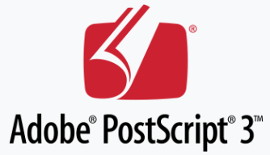

# Advent of Code 2025
*In PostScript!*

By Anders Piniesjö.

This is an attempt to solve the [Advent of Code for 2025](https://adventofcode.com/2025) 
in **PostScript**.

## Why
About 27 years or so ago I wrote [PS-HTTPD](https://www.pugo.org/projects/pshttpd), 
a web server in PostScript.
Ten years after that I made PostScript based printer drivers 
for the Opera Web browser. During the years since then, 
I have forgotten most of that quite funky language.
It was time to bring the memories back to life!

## Goal
The goal is that each day's task should be executable on a
PostScript printer. No non standard extensions will be used.
It is possible that some tasks will be very demanding for a
normal printer (e.g. day 8 step 2), but it should still be
possible to print.

During development and for reasonable execution I use
the fantastic Ghostscript. The Ghostscript developers have
provided us a free PostScript intepreter since 1988!

## Running
The data input files (`input.txt`) are personal and not included
in this repository. To run a task, place your own `input.txt` in
respective directory and run `make run`.

## What is Postscript?
[PostScript (PS)](https://en.wikipedia.org/wiki/PostScript) is a 
Turing complete page description language invented by Adobe. 
It was introduced in 1982. The most recent version, PostScript 3, 
was released 1997.

PostScript has mainly been used as a page description language for
sending documents to printers. It has historically also been used
for monitor graphics, then called Display PostScript. 

Compared to rasterized printer driver formats, such as PCL,
PostScript allows more advanced possibilities. One major benefit
is that PostScript in general is vector based and allows
good print quality, regardless of printer resolution.

As a language it is largely different from modern normal languages.
It is stack based and is conceptually relatively close to the language
FORTH. Calculations are made by pushing values on the stack and
calling operaitons. Operations pops the operands from the stack and
pushes the result to the stack. PostScript has support for `if` and 
`if-else` structures as well as normal loop structures, arrays and dicts.
Recursion is possible but limited. The main problem with PostScript
for something such as Advent of Code is that it lacks local scopes.
That also makes recursion problematic for tree searching.

*The successor of PostScript is PDF.*

## Results
I have currently managed to finish days 1 to 10.

I for long thought that day 10 part 2 exceeded what is practical
or possible in PostScript. But after expressing my problems on
Reddit, telling about the PostScript limitations i got good
answers with new insights on day 10 part 2. That helped me
develop a better solution. Even though it took some 10 minutes
to calculate through all the "machines" for that task on a modern
machine I got the correct answer!

